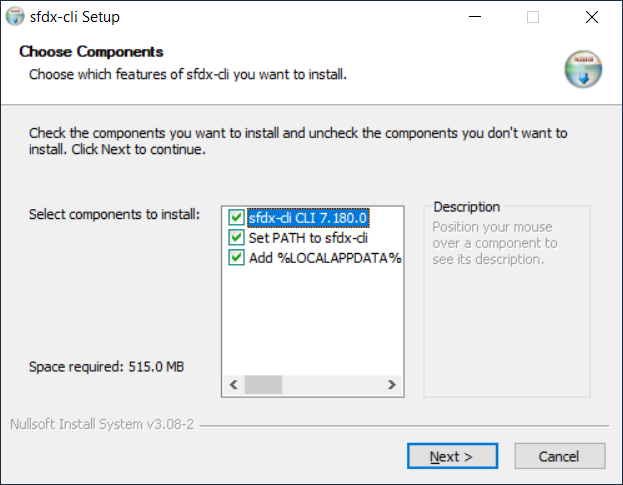
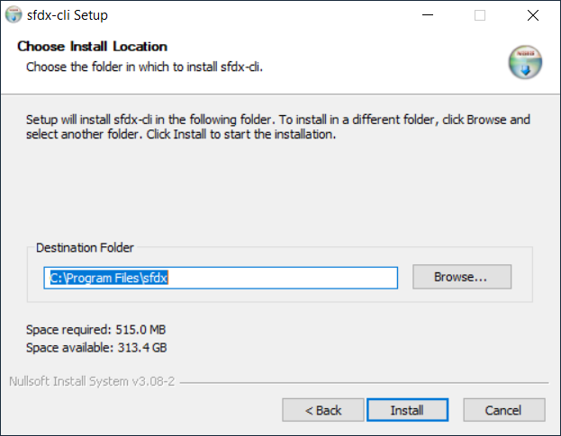
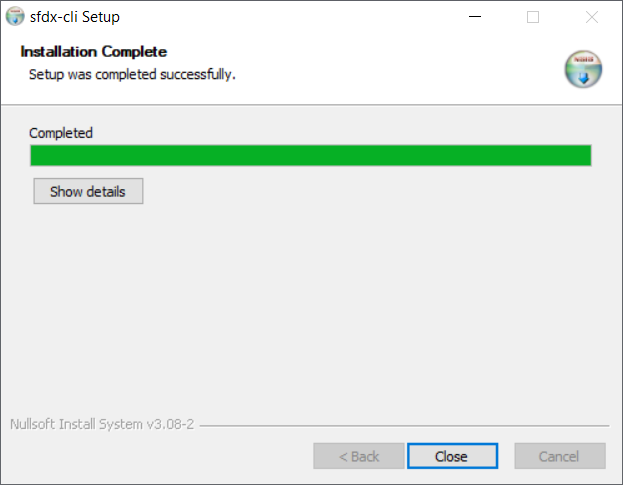

[Menu](../index)

Pour télécharge GIT, suivez le lien suivant [Install Salesforce CLI](https://developer.salesforce.com/docs/atlas.en-us.sfdx_setup.meta/sfdx_setup/sfdx_setup_install_cli.htm) et 
selectionnez le lien correspondant à votre systeme d'exploitation.

# Installation pour Windows

1. Sur la page d'installation des CLI pour Windows, cliquez sur le line de Download du fichier excutable
2. Lancez le fichier téléchargé et accepter que le programme apporte des modifications à votre ordinateur.
3. Sur l'écran de sélection des composants, cliquez sur Next.

4. Sélectionner votre répertoire d'installation et Cliquez sur Install.

5. Cliquez sur Close une fois l'installation terminée.

	
Une fois Salesforce CLI installé, redemarrez votre ordinateur.

# Vérification de l'installation

Pour vérifier votre installation ouvrez un terminal et tapez la commande suivante:
```js
sfdx --version
// La verison actuellement installée des CLI doit s'afficher
sfdx-cli/7.144.0 darwin-x64 node-v16.14.2
```

Pour voir l'ensemble des plugins et leurs versions:
```js
sfdx plugins --core
```

Pour mettre à jour les Salesforce CLI
```js
sfdx update
```

[Menu](../index)
