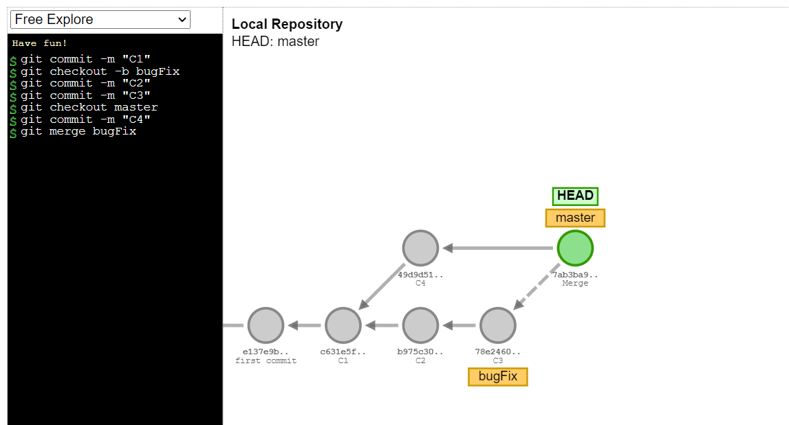

[Menu](../index)

# Playgrounds GIT
Pour aller plus loin de manière un peu plus ludique, nous vous proposons deux références pour 'Jouer' avec GIT.

## Git School

Git School est une pplication permettant de demystifier ce qui se passe sous le capot lorsque nous utilisons des commandes GIT.
Il permet de taper des commandes sur la gauche et de voir l'evolution de l'arbre sur la droite. On peut travailler en local ou remote.

[Ouvrir Git School](http://git-school.github.io/visualizing-git/#free)

>
> Pour plus d'informations tapez help dans la ligne de commande
>

## Learn Git Branching

Learn Git Branching se présente comme une série de tutorials accompagnés d'exercices pratiques sous la forme d'un jeu à différents niveaux.
Au fur et a mesure que l'on saisi les commandes du challenge, l'arbre sur la droite se met a jour.

[Ouvrir Learn Git Branching](https://learngitbranching.js.org/?locale=en_US)

[Menu](../index)
