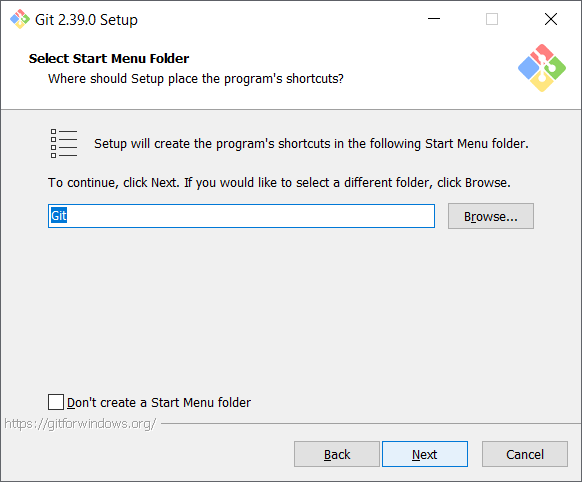
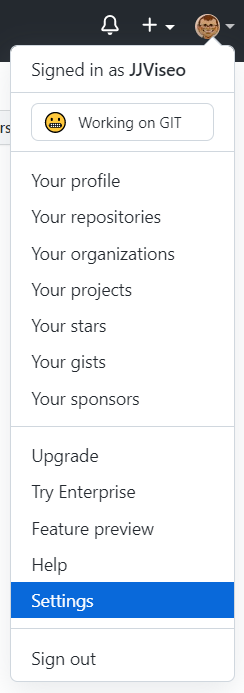
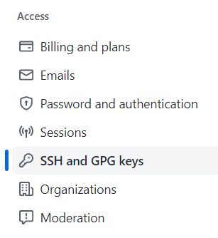
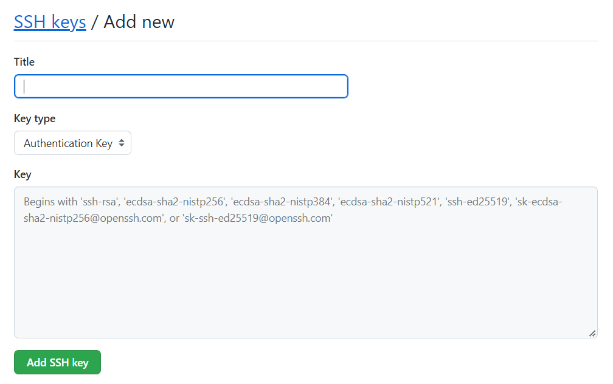

[Menu](../index)

Pour télécharge GIT, suivez le lien suivant [GIT Download](https://git-scm.com/downloads) et selectionnez la version correspondant à votre systeme d'exploitation.

# Installation pour Windows
1. Lancez le fichier téléchargé et accepter que le programme apporte des modifications à votre ordinateur.
2. Un ecran d'information de license s'affiche, cliquez sur **Suivant**

3. GNU's not unix cliquez sur **Install**

4. (Optionel) Sélectionnez le répertoire d'installation, cliquez sur **Suivant**

5. (Optionel)  Sélectionnez les composants optionnels à installer et cliquez sur **Suivant**

6. (Optionel) Choisissez une option de nom pour le menu démarrer et cliquez sur **Suivant**

7. (Optionel) Choisissez un editeur par défaut et claiquez sur **Suivant**

8. (Optionel) Choisissez le nom de branche par défaut et cliquez sur **Suivant**

9. (Optionel) Choisissez vos options de Path et cliquez sur **Suivant**

10. (Optionel) Choisissez votre executable SSH et cliquez sur **Suivant**

11. (Optionel) Choisissez une lib SSL/TLS et cliquez sur **Suivant**

12. (Optionel) Définisser les caractères de fin de ligne et cliquez sur **Suivant**

13. (Optionel) Choisisez votre Terminal et cliquez sur **Suivant**

14. (Optionel) Choisissez le comportement associé à la commande GIT PULL et cliquez sur **Suivant**

15. (Optionel) Choisissez un Credential Manager et Cliquez sur **Suivant**

16. (Optionel) Choisissez des options optionnelles supplémentaires et cliquez sur **Suivant**

17. (Optionel) Encore des options que je préfère ne pas prendre, cliquez sur **Suivant**

18. Attendez la fin de l'installation de GIT et cliquez sur **Finir**


Une fois GIT installé, redemarrez votre ordinateur.

# Vérification de l'installation

Pour vérifier votre installation ouvrez un terminal et tapez la commande suivante:

```js
git --version
// La version actuellement installée de GIT doit s'afficher
git version 2.39.0.windows.1
```

# Saisie d'une clé SSH dans GIT

1. Pour saisir votre clé SSH dans GIT cliquez sur votre menu utilisateur en haut à droite de l'écran

2. Cliquez sur **Settings**

3. Dans le menu à gauche cliquez sur **SSH and GPG Key**

4. Donnez un nom à votre clé et collez votre clé dans le champ Clé

5. Validez en cliquant sur **Ajouter une clé SSH**

[Menu](../index)
