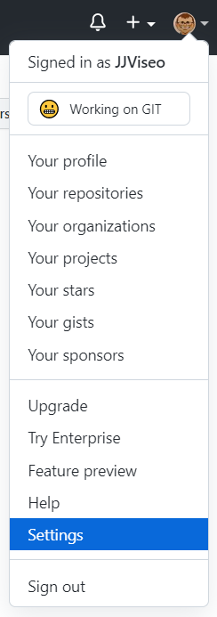
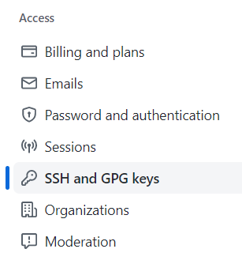
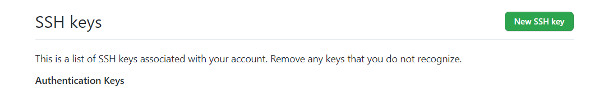
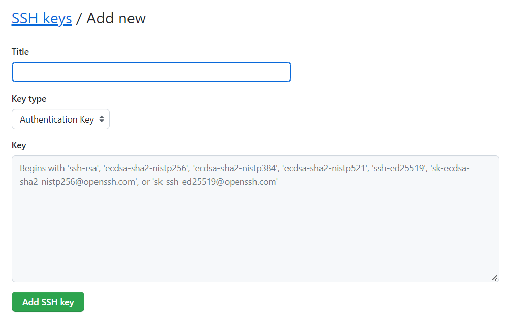

[Menu](../index)

Vous pouvez générer une nouvelle clé SSH sur votre ordinateur local. Après avoir généré la clé, vous pouvez l’ajouter à votre compte sur GitHub.com afin d’activer l’authentification pour les opérations Git sur SSH.
# Generation de votre clé SSH

1. Ouvrez Git Bash.
2. Collez le texte ci-dessous en indiquant votre adresse e-mail GitHub.

```js
$ ssh-keygen -t ed25519 -C "your_email@example.com"
// Cette opération crée une clé SSH, qui utilise l’e-mail fourni comme étiquette.
Generating public/private ALGORITHM key pair.
```

3. Saisissez l'emplacement où sera enregistrée la clé.
4. À l’invite, tapez une phrase secrète sécurisée.

# Saisie d'une clé SSH dans GIT

1. Pour saisir votre clé SSH dans GIT cliquez sur votre menu utilisateur en haut à droite de l'écran

2. Cliquez sur **Settings**

3. Dans le menu à gauche cliquez sur **SSH and GPG Key**

4. Donnez un nom à votre clé et collez votre clé dans le champ Clé

5. Validez en cliquant sur **Ajouter une clé SSH**

# Test de votre connexion SSH avec GitHub

1. Ouvrez Git Bash
2. Tapez la commande suivante et saisissez votre mot de passe s'il vous est demandé

```js
$ ssh -T git@github.com
// Saisissez vote mot de passe lorsqu'il vous est demandé
Hi Jean! You've successfully authenticated, but GitHub does not provide shell access.
```

[Menu](../index)
