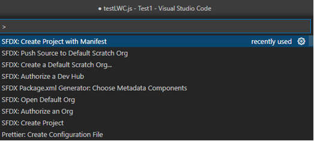

#Création de la Scratch Org

Etape 1 : Il faut tout d'abord activer le DevHub dans l'org de PROD (Setup -> Dev Hub)

Etape 2 : Sur VS Code il faut faire "Create project with manifest

Etape 3 : Authorize a Dev Hub, on va avoir une redirection pour se connecter à l'org

Etape 4 : Create a default Scratch Org...

Etape 5 : Open Default Org, ce qui va nous donner accès à la scratch org tout juste créer.
