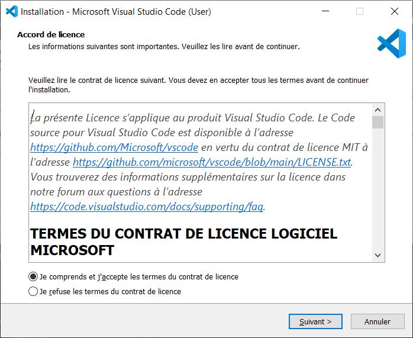
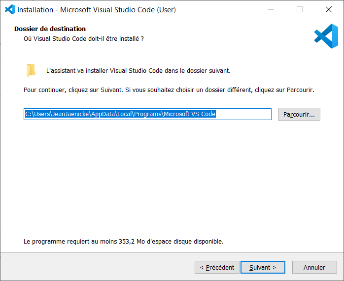
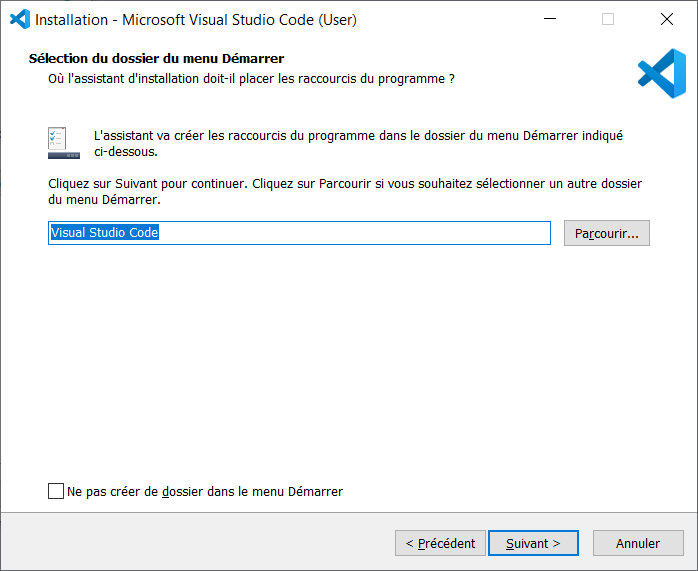
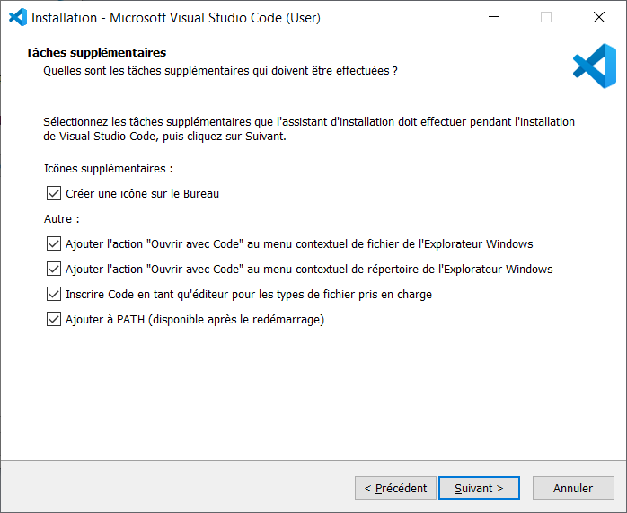
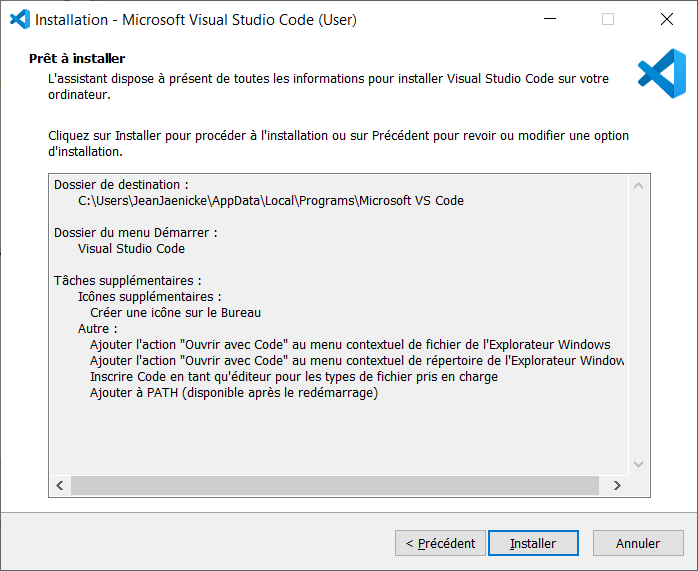
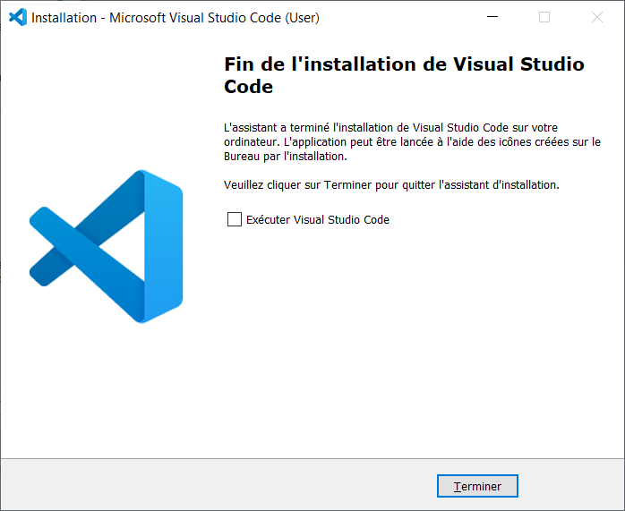

[Menu](../index)

Pour télécharge Visual Studio Code (VSCode), suivez le lien suivant [Install VSCode](https://code.visualstudio.com/) et 
selectionnez le lien correspondant à votre systeme d'exploitation.

# Installation pour Windows

1. Sur la page d'installation de VSCode, cliquez sur le bouton de Download du fichier excutable.
2. Lancez le fichier téléchargé.
3. Sur l'écran d'accord de license, sélectionnez "Je comprends et j'accepte les termes du contrat de license" et cliquez Suivant

4. Sélectionner votre répertoire d'installation et Cliquez sur Suivant.

5. Gérez les options du menu démarrer (Optionel) et cliquez sur Suivant.

6. Sélectionnez les Options d'installation de VSCode et cliquez sur Suivant.

7. Sur l'écran récapitulatif cliquez sur Installer.

8. Cliquez sur Terminer une fois l'installation terminée.

	
Une fois l'installation terminée redemarrez votre ordinateur.

[Menu](../index)

	