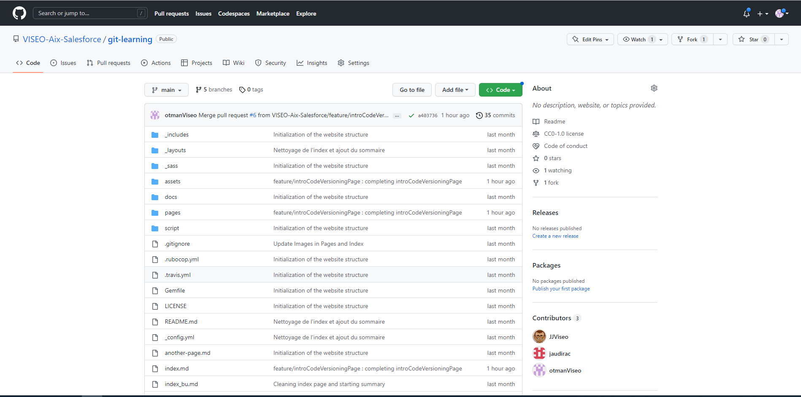
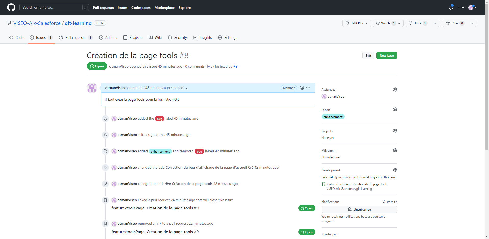
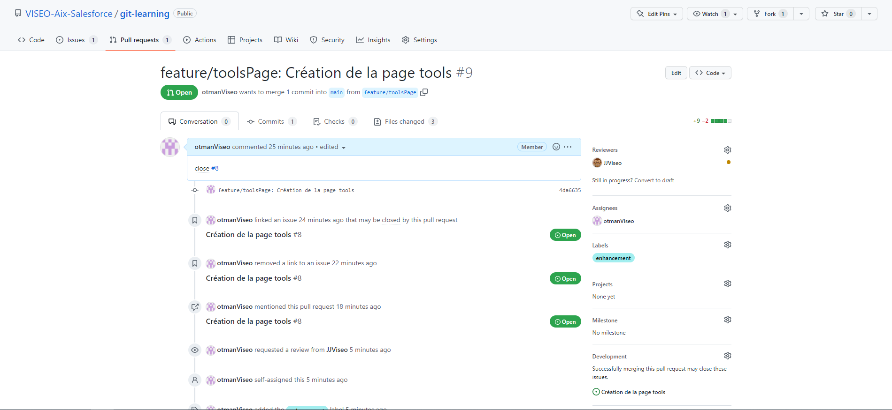
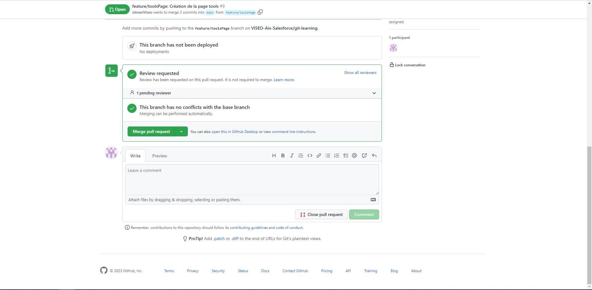
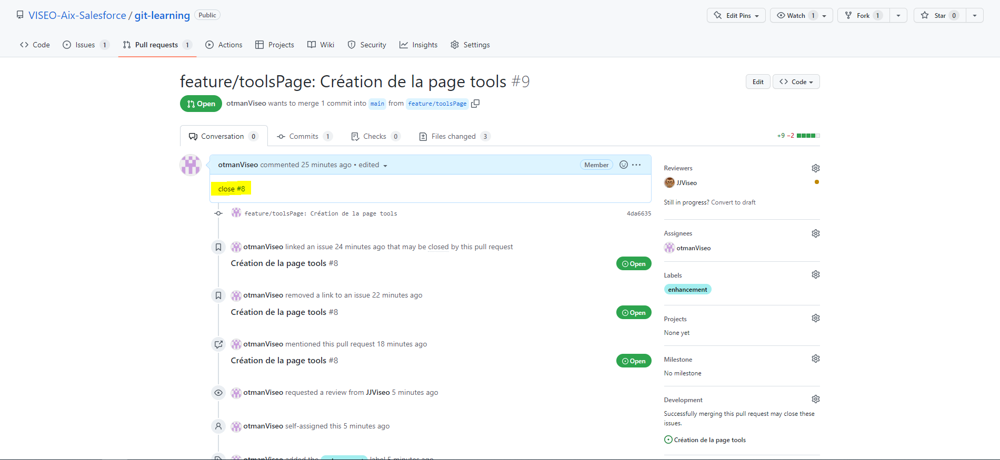

# Les plateformes d'hébergement pour le versioning et la collaboration
Précedemment dans la section d'introduction à Git, nous avons passé en revue le fonctionnement de git, il est temps d'aborder un autre point essentiel à savoir la collaboration entre les collaborateur à travers le cloud grâce aux plateformes d'hébergement. La plateforme d'hébergement qui sera étudiée ici est Github, il en existe d'autres et notamment Gitlab. Github est une plateforme d'hébergement qui permet aux collaborateurs de pouvoir travailler ensemble sur un même serveur git.
Passons en revue les fonctionnalités les plus importantes 

## Visualisation du code et édition de celui ci cia l'onglet Code
L'onglet Code permet de visualiser l'ensemble des fichiers présents dans le repository distant sous la forme d'un système de fichier

Dans cet écran, il est possible d'apporter des modification au projet sans même avoir besoin d'installer Git sur la machine en local. C'est pratique notamment lorsque l'on souhaite faire une modif simple et rapide. La modification est bien sûr commitée sur la branche qui sera choisie, (ici la branche main).

## Issue
Cet onglet permet la création d'une issue ou ticket. Une issue est un ticket qui décrit une feature à réaliser ou bien bug à corriger. Il s'agit d'une description du travail à réaliser.

Dans et image on peut voir que l'issue comporte les informations classiques que peut contenir un ticket Jira par exemple à savoir à une description du besoin, le développeur à qui est assigné le ticket, et d'autres informations. De plus cette issue peut être liée à une Pull Request les Pull Request et la liaison entre Issue et celle ci seront discutés dans les sections suivantes.

## Pull Requests
La Pull Request est un mécanisme qui permet de fusionner le travail effectué sur une branche de feature sur la branche commune principale. La PR a une branche source (qui est la créée par le développeur depuis la branche principale) et une branche destination (qui est la branche commune ou master) sur laquelle on souhaite fusionner les modification réalisées.

La Pull Request contient le code qui sera mergée sur la branche de destination.
Une fois le travail terminé et que l'on souhaite merger le code il suffit de cliquer sur le bouton Merge pull Request

## Lier les issues et les Pull Request
Il est possible de lier les Pull Request et les issue. En effet, on peut lier ceux là pour que lorsque la PR est mergée dans le branche de destination, l'issue liée soit automatiquement fermée dans la foulée.
Afin de faire cela, github nous met à disposition un certain nombre de mot clé que nous pouvons écrire dans la description de la Pull Request

- close
- closes
- closed
- fix
- fixes
- fixed
- resolve
- resolves
- resolved

Exemple:  Close #8 permet de fermer l'issue #8 lorsque la pull request est mergée.
Ce commentaire est à ajouter dans la description du ticket

[back](./)
