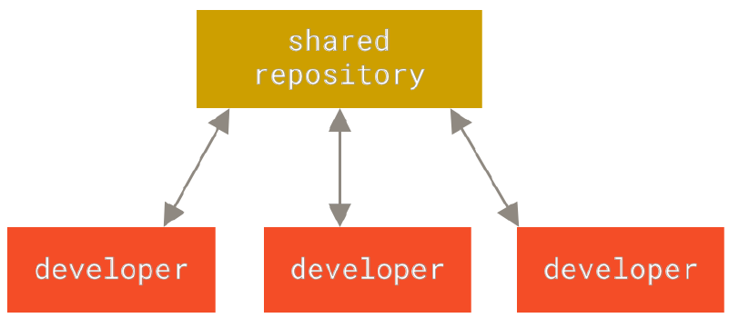
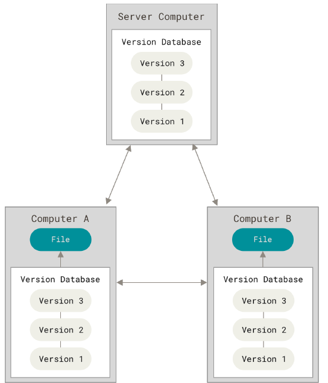
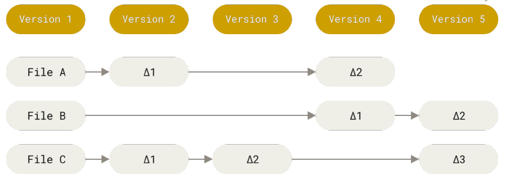
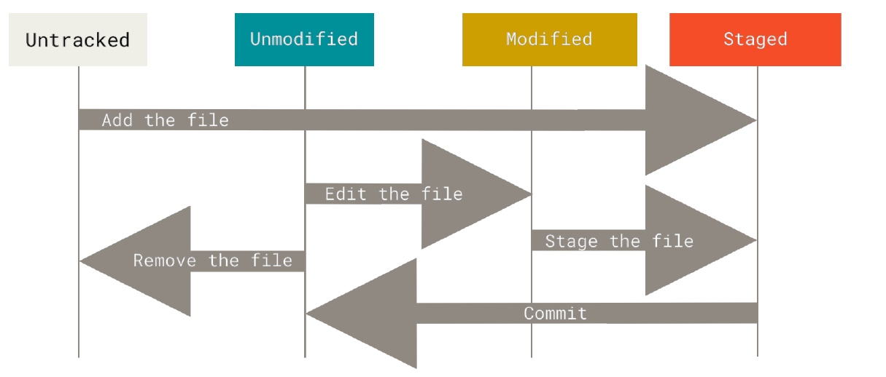

# Introduction au versioning de code 
(note: le informations sur cette page sont issues principallement du manuel officiel Pro Git)

## Le version de code c'est quoi ?
Le versioning de code est un système qui enregistre les modifications apportées à un fichier ou un ensemble de fichiers au cours du temps afin de pouvoir garder une trace des modifications passées. Si l'on est par exemple web designer et que l'on souhaite par exemple garder une trace de chacune des version d'une image, un VCS (Version Control System) est l'outil approprié. Les VCSs nous permettent de restaurer des fichiers à un état précédent, restaurer tous le projet à un état précédent, comparer les changements au cours du temps, trouver qui a modifié tel fichier à l'origine d'un éventuel bug etc...
Utiliser un VCS signifie donc que si on vient à perdre un fichier, une modification importante,  il est aisé de restaurer le travail.

## Les LCVS
Ususellement, lorsque l'on souhaite conserver plusieurs versions d'un fichier, on copie simplement les fichiers d'un dossier à un autre (un dossier daté par exemple). Cette méthode en apparence simple peut introduire de nombreuses erreurs : par exemple on peut oublier qui a fait telle modif, on peut effacer accidentellement le dossier etc...
Afin de résoudre ce problème, les progammeurs ont développé les LCVSs (Local Version Control Systems) qui sont des systèmes associé à une base de données permettent de garder une trace des changements

 

## Les CVCS
Les CVCS (Centralized Version Control Systems ou système de gestion de version centralisé) ont été créés car les déveleppeurs ont eu le besoin de collaborer avec d'autres développeurs travaillant sur des systèmes différents. Les CVCSs (CVS, Svn et d'autres) ont une architecture client serveur: un serveur central contient tous les fichiers versionés et les client peuvent récupérer ces fichiers, envoyer des modifications sur ce serveur distant. Ce système à été pendant de nombreuses années le fonctionnement standard du versioning de code, notamment Svn qui est encore largement utilisé.

Les systèmes de contrôle de version distribués offrent de nombreux avantages comparés aux systèmes locaux vus précédemment. Les systèmes distribués permettent de savoir ce que les collègues font sur le projet, on a la possibilité de gérer les droits et permissions des utilisateurs. Cependant il existe un défaut majeur inhérent aux CVCSs, si le serveur est indisponible pendant 1H, cela veut dire que pendant 1H (pas de connexion internet, problème de connexion VPN et autres...) il sera impossible de collaborer sur le projet, ni partager leurs codes. Pire encore, si les fichiers sur le serveurs sont perdus, et qu'aucun backup n'est fait, alors le projet est perdu car il sera impossible de restaurer le code source. La perte concernera les code source ainsi que l'historique du projet car cet historique n'est pas stocké non plus en local sur les machines des collaborateurs. C'est bien sûr la même chose pour les LCVSs.

## Les DVCSs
Les DVCSs (Distributed Version Control Systems ou système de gestion de version décentralisé) contrairement aux systèmes centralisés ne se contentent pas de seulement récupérer la dernière version d'un fichier, ils font une copie de l'ensemble du repository et de l'historique complet de celui-ci. Ce fonctionnement permet, en cas de panne, d'assurer en cas de perte de données sur le serveur la possibilité de pouvoir le restaurer à partir d'une copie présente sur les ordinateurs en local de l'un de collaorateurs. Chaque clone du repository présent sur chaque machine peut être utilisé afin de restaurer les données perdues. 

## Git c'est quoi ?

### Fonctionnement par instantannés successifs
Dans cette section nous allons les spécificités de Git ainsi que son fonctionnement. C'est une section qu'il faut comprendre afin de pouvoir comprendre le reste de cette formation.
Les systèmes de versioning tel que Svn, CVS, Bazaar fonctionnent selon un sytème de différence et seul le delta correspondant aux changement sur les fichiers est enregistré au cours du temps, ce système de fonctionnement est dit "delta-based" ou basé sur les différence.

Git en revanche fonctionne sur un sytème d'instantanné ou de "snapshot". A chaque commit, Git prend un instantanné de l'état des fichiers et enregistre une référence vers cet instantanné. Toutefois, si entre 2 instantanné, l'état des fichiers n'a pas changé alors les fichiers ne sont pas enregistrés à nouveau. On dit que Git fonctionne selon une suite d'instantannés.

Git se différencie des autres systèmes de versioning car celui se rapproche d'un système de gestion de fichiers.

### Les opérations se font en local (presque toutes)
La plupart des opérations se font en local et n'ont même pas besoin d'accès internet pour être réalisées. La plupart des opérations et commandes s'éxécutant en local, on gagne enormément en rapidité car les informations n'on pas besoin de remonter au serveur central et de redescendre à chaque traitement. Pour l'historique du projet, ici encore celui-ci est déjà présent sur la machine en local, on peut l'afficher sans avoir besoin de le récuperer depuis le serveur (il faut quand même l'avoir récupéré au préalable évidemment). La disponibilité de cet historique en local nous permet donc de pouvoir voir l'historique de n'importe quel fichier sans avoir besoin de le récupérer depuis le serveur. Ce fonctionnement implique que Git fonctionne même sans connexion internet (en cas de déplacement en avion par exemple, ou d'absence de connexion) il n'y a donc plus d'interruption de travail.

### Intégrité des données
Chaque commit est référencé par un checksum SHA1 qui est une chaîne de texte de 40 caractères codée en héxadécimal(base 16, c'est à dire 0-9 et a-f) exemple <24b9da6552252987aa493b52f8696cd6d3b00373>. Ce checksum est calculé à partir des fichiers commités. Donc permet de repérer les éventuels changement apportés à des fichiers.

### Les trois états
Dans cette section sera décrite le fonctionnement le plus important de git. Pour Git, un fichier peut se trouver dans l'un des 4 états suivants:
- Untracked: Dans cet état, le fichier existe physiquement mais ne sera pas suivi par Git
- Unmodified: Dans cet état, Git suit activement les changements qui peuvent se produire sur le fichier mais celui ci n'a pas de modification depuis le dernier instantanné
- Modified: Ici, il s'agit d'un fichier suivi par Git pour lequel des changements ont été apportés depuis le dernier instantanné
- Staged: Ici le fichier est suivi par git, des modifications ont été apportés depuis le dernier instantanné et ces modifications seront enregistrées lors du prochain commit
Le schéma vous présentera le passage d'un état à l'autre lors de la vie d'un projet

[back](./)
