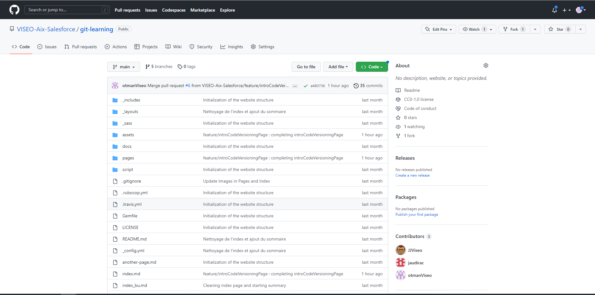

# Les plateformes d'hébergement pour le versioning et la collaboration
Précedemment dans la section d'introduction à Git, nous avons passé en revue le fonctionnement de git, il est temps d'aborder un autre point essentiel à savoir la collaboration entre les collaborateur à travers le cloud grâce aux plateformes d'hébergement. La plateforme d'hébergement qui sera étudiée ici est Github, il en existe d'autres et notamment Gitlab. Github est une plateforme d'hébergement qui permet aux collaborateurs de pouvoir travailler ensemble sur un même serveur git.
Passons en revue les fonctionnalités les plus importantes 

## Visualisation du code et édition de celui ci cia l'onglet Code
L'onglet Code permet de visualiser l'ensemble des fichiers présents dans le repository distant sous la forme d'un système de fichier

Dans cet écran, il est possible d'apporter des modification au projet sans même avoir besoin d'installer Git sur la machine en local. C'est pratique notamment lorsque l'on souhaite faire une modif simple et rapide. La modification est bien sûr commitée sur la branche qui sera choisie, (ici la branche main).

## Issue
Cet onglet permet la création d'une issue ou ticket
[back](./)
